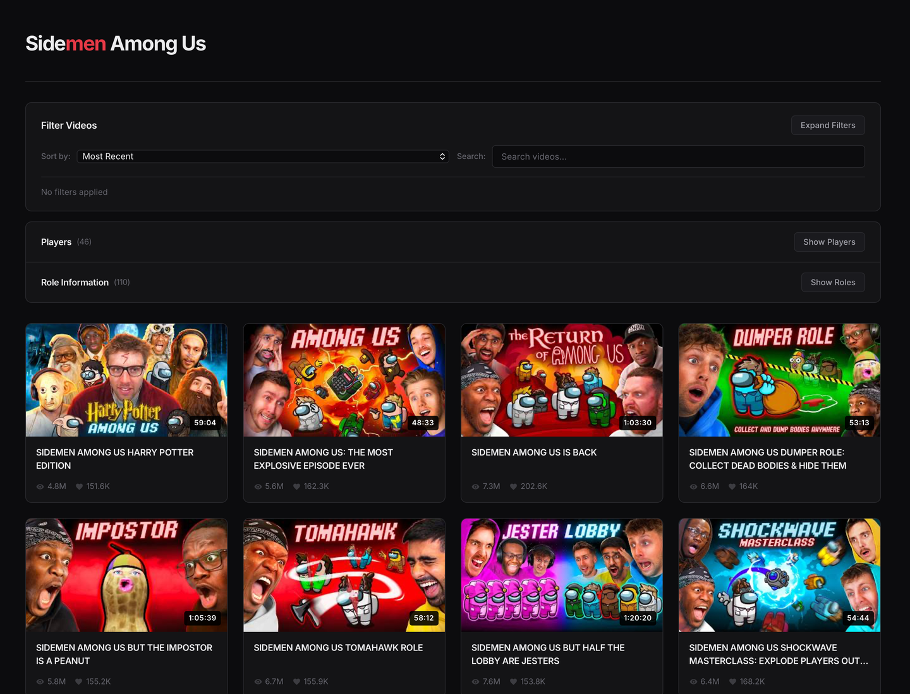

<p align="center">
  
</p>

# Sidemen Among Us — Fan Archive

**Every Sidemen Among Us video, searchable by player, role, map and game mode.**

Unofficial fan project, not affiliated with the Sidemen. All video content belongs to its owners. It ran at sidemenamongus.co.uk with the client on Vercel and the API on Render.

The Sidemen have played Among Us on YouTube since 2020: 120+ videos, hundreds of games, dozens of modded roles. This site turns that back catalogue into a browsable archive. The server pulls the playlist from the YouTube Data API, joins each video to a community-maintained Google Sheet of game results (who played, which roles they drew, which map, who won), and scrapes role descriptions from three Among Us mod wikis. The React client lets you slice it however you like: *show me every video where Harry was an Impostor on Polus*, sorted by views.


## Features

- **Include / exclude filters** for players, roles, maps and game modes. Each filter is tri-state, so you can require a player *and* rule another one out in the same query.
- **Sort and search.** Most recent, most popular, most liked, oldest, plus free-text title search. The list re-ranks instantly because filtering is memoised client-side over the full dataset.
- **Player leaderboard** built from the sheet: games played, wins, losses, win rate, kills, deaths and K/D.
- **Role glossary.** 69 roles from the *All The Roles*, *The Other Roles* and *Town of Us R* mods, grouped by crewmate / impostor / neutral, with descriptions parsed from each mod's wiki.
- **Hover cards** on every video listing the players and roles in that game, with touch-friendly positioning on mobile.
- **Infinite scroll** in pages of 21 using an `IntersectionObserver`.
- **Resilient API.** Every data source is cached for 20 minutes in memory and persisted to disk. If YouTube, Google Sheets or GitHub are unreachable the server falls back to the last good snapshot, and the client retries with a short back-off.
- **Production polish.** Route-level code splitting with prefetching, Terser minification, Vercel security headers (CSP, HSTS, frame denial), Open Graph and JSON-LD metadata, a sitemap and a web manifest.

## How it works

```text
 YouTube Data API v3 ─────┐
 (playlist + statistics)  │
                          │      ┌──────────────────────────┐        ┌──────────────────────┐
 Google Sheet (gviz JSON) ┼────▶ │  Express API  (server/)  │ ─────▶ │ React SPA  (client/) │
 (games, players, roles)  │      │  20-min cache + snapshot │  JSON  │ filters · sort · UI  │
                          │      └──────────────────────────┘        └──────────────────────┘
 Mod wikis on GitHub ─────┘
 (role descriptions)
```

| Endpoint | Returns |
|---|---|
| `GET /api/videos` | Every video in the playlist with duration, views, likes, publish date, and the players, roles and map(s) joined from the sheet |
| `GET /api/sheetData` | The raw sheet tabs: player stats, role stats, per-game results, event log, impostor combos |
| `GET /api/roles` | Role descriptions merged from the three mods, keyed by team |
| `GET /api/reset-cache` | Clears the caches and snapshot files (handy in development) |

The role fetchers are the interesting part: one clones the *All The Roles* wiki with `simple-git` and parses the Markdown role pages, the other two download the mod READMEs and extract the role tables with regular expressions, then everything is normalised into a single `{ crewmate, impostor, neutral }` shape.

## Getting started

You need Node.js 20 or newer (last verified on Node 26). A YouTube API key is optional: the repository ships with a snapshot of the video data, so the server runs without one.

```bash
git clone https://github.com/tayaa710/sidemen-among-us.git
cd sidemen-among-us

# 1. API server on http://localhost:3001
cd server
cp .env.example .env          # add APIKEY if you want fresh YouTube data
npm install
npm run dev

# 2. Client on http://localhost:5173 (in a second terminal)
cd ../client
cp .env.example .env          # VITE_API_URL defaults to http://localhost:3001
npm install
npm run dev
```

`npm run refresh` in `server/` deletes the snapshot files and rebuilds them from the live sources. Requires `APIKEY`.

## Deployment

The two halves deploy separately from this one repository:

| Part | Host | Settings |
|---|---|---|
| `client/` | Vercel | Root directory `client`, framework Vite. Set `VITE_API_URL` to the server URL. `vercel.json` supplies headers, redirects and the SPA rewrite. |
| `server/` | Render (web service) | Root directory `server`, build `npm install`, start `npm start`. Set `APIKEY` and `PORT`. |

## Project structure

```text
client/
  src/
    App/               shell, lazy-loads the home screen and prefetches the rest
    HomeScreen/        data fetching, filtering, sorting and infinite scroll
      filterBar/       sort, search and the tri-state include/exclude selectors
      players/         leaderboard and role glossary
    Video/             video card with hover/touch info card
  public/              favicons, manifest, robots, sitemap
  vercel.json          security headers, caching, SPA rewrite
server/
  index.js             Express app, caching and the four endpoints
  utils/
    fetchVideos.js     YouTube playlist + statistics, joined to sheet data
    fetchSheetData.js  Google Sheets gviz endpoint → JSON
    fetch*Mod.js       role description scrapers for the three mods
  roleInformation/     parsed role descriptions (committed snapshot)
  videoData.json       video snapshot (committed, refreshed when APIKEY is set)
  sheetData.json       sheet snapshot
```

## Data sources and credits

- Video metadata from the [YouTube Data API](https://developers.google.com/youtube/v3).
- Game results from a community-maintained Google Sheet tracking every Sidemen Among Us game.
- Role descriptions from the [All The Roles](https://github.com/Zeo666/AllTheRoles), [The Other Roles](https://github.com/TheOtherRolesAU/TheOtherRoles) and [Town of Us R](https://github.com/eDonnes124/Town-Of-Us-R) mod projects.

This is a non-commercial fan site. It is not affiliated with, endorsed by, or connected to the Sidemen.

The visual design (the dark theme, layout and CSS) was done with Claude, because visual design is not my strong point. The data pipeline, the API and its caching, the wiki scrapers, the React components and the filtering logic are my own work.

## License

[MIT](LICENSE)
